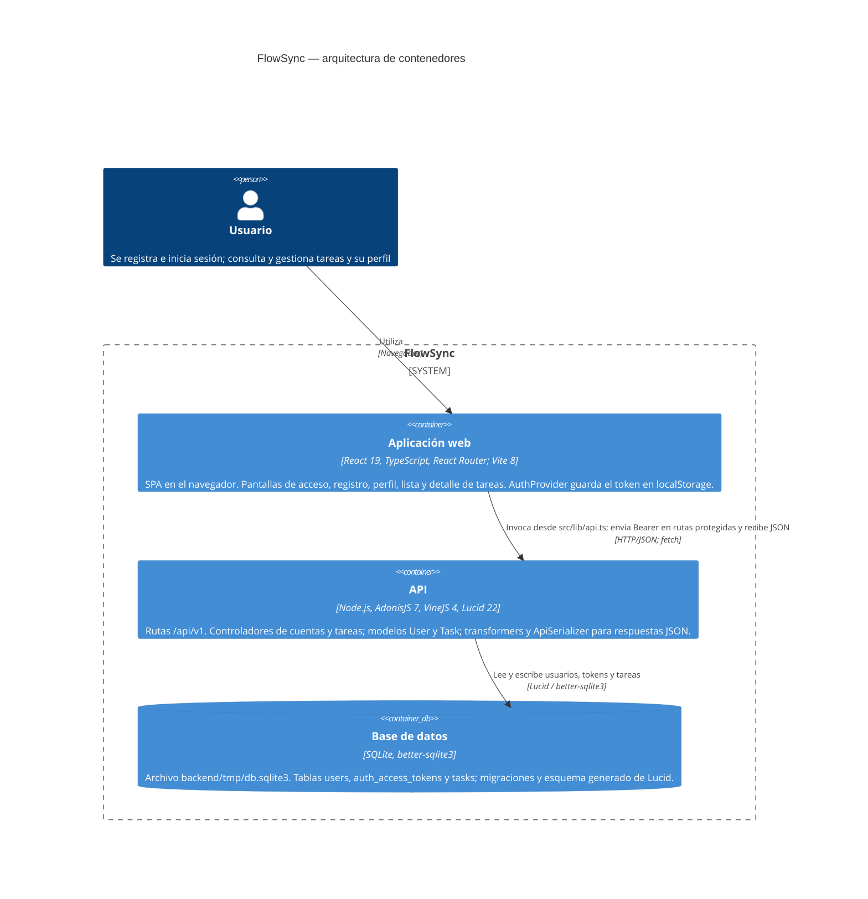

# Arquitectura de FlowSync

Este diagrama C4 de contenedores muestra la arquitectura implementada de FlowSync: una SPA de React ejecutada en el navegador, una API de AdonisJS y una base de datos SQLite en archivo. La SPA consume la API mediante HTTP/JSON y tokens Bearer; la API valida las peticiones, accede a los datos con Lucid y construye las respuestas con transformers. Las rutas, los controladores y la persistencia descritos debajo proceden de los archivos del repositorio.

## Correspondencia con el código

- **Frontend:** `frontend/src/main.tsx` monta `BrowserRouter`, `AuthProvider` y `AppRoutes`. `frontend/src/routes/app-routes.tsx` declara `/login`, `/register`, `/profile`, `/tasks` y `/tasks/:id`, con los guards `PublicOnlyRoute` y `ProtectedRoute`. `frontend/src/auth/auth-provider.tsx` conserva el token bajo `flowsync.token` en `localStorage` y restaura la sesión consultando el perfil. `frontend/src/lib/api.ts` centraliza `fetch`, los headers Bearer, el desempaquetado de `data` y la traducción de errores; usa `VITE_API_URL` o, por defecto, `http://localhost:3333`. Vite y Tailwind están configurados en `frontend/vite.config.ts`.
- **Entrada de la API:** `backend/start/routes.ts` enlaza las rutas con los controladores mediante el registro generado en `backend/.adonisjs/server/controllers.ts`. `backend/start/kernel.ts` registra middleware de JSON, CORS, parseo y autenticación. El guard por defecto de `backend/config/auth.ts` es `api`, basado en tokens de acceso; los grupos `account` y `tasks` exigen autenticación.

### Rutas y controladores

Todas las rutas de la tabla llevan el prefijo `/api/v1`, declarado en `backend/start/routes.ts`. Los controladores están en `backend/app/controllers/`.

| Método | Ruta                  | Controlador y método             | Token requerido |
| ------ | --------------------- | -------------------------------- | --------------- |
| POST   | `/auth/signup`        | `NewAccountController.store`     | No              |
| POST   | `/auth/login`         | `AccessTokensController.store`   | No              |
| GET    | `/account/profile`    | `ProfileController.show`         | Sí              |
| POST   | `/account/logout`     | `AccessTokensController.destroy` | Sí              |
| GET    | `/tasks`              | `TasksController.index`          | Sí              |
| POST   | `/tasks`              | `TasksController.store`          | Sí              |
| GET    | `/tasks/:id`          | `TasksController.show`           | Sí              |
| PATCH  | `/tasks/:id/status`   | `TaskStatusesController.update`  | Sí              |
| PUT    | `/tasks/:id/due-date` | `TaskDueDatesController.update`  | Sí              |

También existe `GET /`, que devuelve `{ hello: 'world' }` directamente desde el archivo de rutas.

### Lógica, representación y datos

- **Validación y modelos:** los controladores utilizan los validadores VineJS de `backend/app/validators/user.ts` y `task.ts`. `backend/app/models/user.ts` extiende `UserSchema`, verifica credenciales y configura `DbAccessTokensProvider`. `backend/app/models/task.ts` extiende `TaskSchema`, define la relación `belongsTo(User)` mediante `assigneeId` y calcula el vencimiento con `isOverdueOn(referenceDay)`. Los controladores de tareas consultan y guardan mediante estos modelos y cargan el responsable.
- **Respuestas:** en `backend/app/transformers/`, `UserTransformer` representa la cuenta; `TaskTransformer`, la tarea para lista, creación y cambio de estado; `TaskDetailTransformer` añade `dueDate` e `isOverdue` al detalle y al cambio de fecha; `TaskAssigneeTransformer` representa al responsable. `backend/providers/api_provider.ts` aporta `serialize()` y envuelve esas respuestas en `{ data: ... }`. El logout devuelve directamente `{ message: 'Logged out successfully' }`. El cliente envía su día local como `today` al consultar el detalle o cambiar el vencimiento.
- **Persistencia:** `backend/config/database.ts` configura la conexión SQLite con `better-sqlite3` y `app.tmpPath('db.sqlite3')`. Las migraciones de `backend/database/migrations/` crean `users`, `auth_access_tokens` y `tasks`, y añaden `tasks.due_date`. `tasks.assignee_id` y `auth_access_tokens.tokenable_id` referencian `users.id`. `backend/database/schema.ts` contiene las clases de esquema autogeneradas usadas por los modelos.
